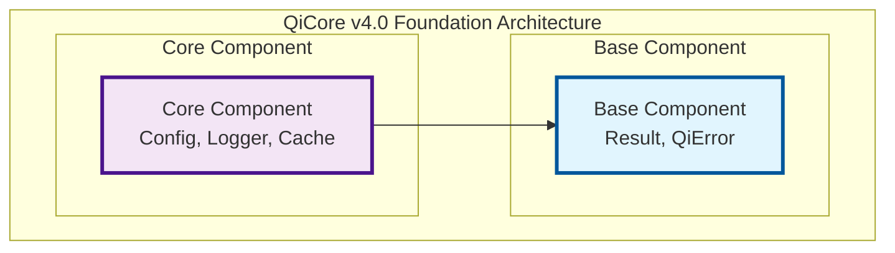

# QiCore v4.0 Foundation Architecture Specification

This document defines the component-level architecture for QiCore v4.0 Foundation. The Foundation consists of two core components that provide mathematical foundation types and essential infrastructure services.

## Foundation Architecture Overview

QiCore v4.0 Foundation is organized into two components with a clear dependency hierarchy:



---

## Base Component

**Purpose**: Foundational error handling and result types used by all other components

### Component Interface

```
BaseComponent provides:
  Result operations:
    - success(data) → Result containing data
    - failure(error) → Result containing error
    - fromTryCatch(operation) → Result from fallible operation
  
  Error operations:
    - create(code, message, category) → QiError
    - withContext(error, contextData) → QiError with context
    - withCause(error, causeError) → QiError with cause chain
```

### Included Contracts
- **Result<T>**: Type-safe error handling with functional composition
- **QiError**: Structured error representation with context and chaining

**📋 Complete Base Contracts**: See [qi.v4.base.contracts.md](qi.v4.base.contracts.md) for detailed behavioral specifications.

### Dependencies
- **None**: Base component has no dependencies

### Exported Types
- `Result<T>`: Success/failure container type
- `QiError`: Structured error type
- `ErrorCategory`: Error classification enum

### Component Guarantees
- **Zero Dependencies**: Can be used standalone
- **Immutable**: All types are immutable after creation
- **Thread-Safe**: Safe for concurrent use
- **Minimal Overhead**: < 1KB runtime overhead

### Usage Pattern
```
// Language-agnostic usage pattern
result = success(42)
doubled = map(multiply_by_2, result)  // Result containing 84

error = create("NETWORK_ERROR", "Connection failed", NETWORK)
failure = failure(error)
```

---

## Core Component

**Purpose**: Essential infrastructure services for configuration, logging, and caching

### Component Interface

```
CoreComponent provides:
  Configuration operations:
    - fromFile(path) → async Result<ConfigData>
    - fromObject(data) → Result<ConfigData>
    - fromEnvironment(prefix) → Result<ConfigData>
    - get(config, key) → Result<value>
    - merge(configs) → Result<ConfigData> // Monoid operation
  
  Logging operations:
    - create(config) → Result<Logger>
    - log(level, message, context?) → void
    - isLevelEnabled(level) → boolean
  
  Cache operations:
    - createMemory(config) → Result<Cache>
    - createPersistent(path, config) → async Result<Cache>
    - get(cache, key) → Result<value>
    - set(cache, key, value, ttl) → Result<void>
```

### Included Contracts
- **Configuration**: Multi-source config loading with monoid merge semantics
- **Logging**: Simple effect interface with level-based filtering
- **Cache**: High-performance caching with eviction policies

**📋 Complete Core Contracts**: See [qi.v4.core.contracts.md](qi.v4.core.contracts.md) for detailed behavioral specifications.

### Dependencies
- **Base Component**: Uses Result<T> and QiError throughout

### Exported Types
- `ConfigData`: Immutable configuration container
- `Logger`: Logger instance type
- `Cache`: Cache instance type
- `LogLevel`: Logging level enum
- `CacheConfig`: Cache configuration options

### Component Guarantees
- **Independent Services**: Config, Logger, and Cache can be used independently
- **Consistent Error Handling**: All operations return Result<T>
- **Async-Aware**: File I/O operations are properly async
- **Performance**: Operations meet language-tier performance targets
- **Resource Management**: Proper cleanup for persistent resources

### Internal Dependencies
- Configuration has no dependencies on Logger or Cache
- Logger may use Configuration for initialization
- Cache may use Configuration for settings and Logger for operations

### Usage Pattern
```
// Language-agnostic usage pattern
configResult = fromFile("app.json")  // async operation
config = unwrapOr(defaultConfig, configResult)

// Monoid merge operation
merged = merge([defaultConfig, fileConfig, envConfig])

// Simple logging interface
logger = create(LogConfig{level: INFO})
log(INFO, "Application started", {version: "1.0.0"}, logger)
```

---

## Component Initialization Patterns

### Dependency-Aware Initialization

```
// Language-agnostic initialization pattern
function initializeQiCore() -> Result<QiCoreContainer>:
  // Base is always available (no initialization needed)
  base = BaseComponent
  
  // Initialize Core components with async operations
  configResult = fromFile("app.json")  // async
  if isFailure(configResult) then
    return failure(getError(configResult))
  end
  config = unwrap(configResult)
  
  // Logger initialization (sync)
  loggerResult = create(get("logging", config))
  if isFailure(loggerResult) then
    return failure(getError(loggerResult))
  end
  logger = unwrap(loggerResult)
  
  // Cache initialization (potentially async for persistent cache)
  cacheConfig = get("cache", config)
  cacheResult = if persistent(cacheConfig) then
    createPersistent(path(cacheConfig), cacheConfig)  // async
  else
    createMemory(cacheConfig)  // sync
  end
    
  if isFailure(cacheResult) then
    log(ERROR, "Cache initialization failed", getError(cacheResult), logger)
    return failure(getError(cacheResult))
  end
  
  // Initialize application components
  core = CoreContainer{config, logger, cache: unwrap(cacheResult)}
  http = createHttp(core)
  document = createDocument(core)
  clp = createCLP(core)
  
  return success(QiCoreContainer{base, core, http, document, clp})
end
```

---

## Component Version Management

### Version Strategy

Each component maintains its own semantic version while ensuring compatibility:

```yaml
component_versions:
  base: "1.0.0"      # Most stable, rarely changes
  core: "1.2.0"      # Moderate change frequency
  http: "1.5.2"      # More frequent updates
  document: "1.3.1"  # Template engine updates
  clp: "1.1.0"       # Stable CLI interface

compatibility_matrix:
  - base: "1.0.0"
    compatible_with:
      core: "1.0.0 - 1.x"
      http: "1.0.0 - 1.x"
      document: "1.0.0 - 1.x"
      clp: "1.0.0 - 1.x"
  
  - core: "1.2.0"
    requires:
      base: "^1.0.0"
    compatible_with:
      http: "1.3.0 - 1.x"
      document: "1.2.0 - 1.x"
      clp: "1.0.0 - 1.x"
```

### Breaking Change Policy

1. **Base Component**: Breaking changes require major version bump of entire framework
2. **Core Component**: Breaking changes require coordinated update of dependent components
3. **Application Components**: Can have breaking changes independently with minor framework version bump

---

## Component Testing Strategy

### Unit Testing
- Each component has isolated unit tests
- Mock implementations for dependencies
- Property-based testing for mathematical laws

### Integration Testing
```
// Language-agnostic integration test pattern
test "HTTP with Cache Integration":
  // Setup
  cache = createMemory(CacheConfig{maxSize: 100})
  http = createHttp(HttpConfig{cache: cache})
  
  // First request hits network
  result1 = get("https://api.example.com/data", http)  // async
  assert(isSuccess(result1))
  
  // Second request hits cache
  result2 = get("https://api.example.com/data", http)  // async
  assert(isSuccess(result2))
  assert(has("https://api.example.com/data", cache))
end
```

---

## Dependencies and References

- **Depends on**: 
  - [Base Component Contracts](qi.v4.base.contracts.md) - Defines Result<T> and QiError behavioral contracts
  - [Core Component Contracts](qi.v4.core.contracts.md) - Defines Configuration, Logger, and Cache behavioral contracts
- **Architecture Summary**: Five components (Base, Core, HTTP, Document, CLP) with clear dependency hierarchy
- **Contract Compliance**: All components must satisfy the behavioral contracts defined in their respective specifications
- **Language Agnostic**: Component architecture applies to all QiCore v4.0 implementations regardless of programming language

---

**Component Architecture**: QiCore v4.0 organizes behavioral contracts into five components with clear dependencies, initialization patterns, and integration requirements that apply across all programming language implementations.