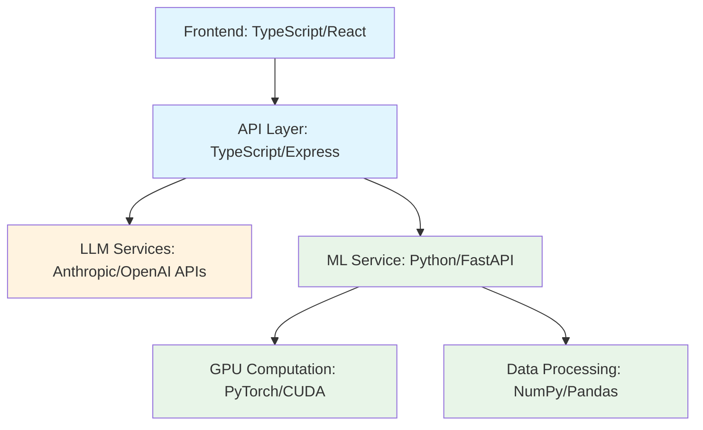

# Windows 11 Pro Development Environment Prerequisites

## System Requirements

- **Windows 11 Pro** (Version 21H2 or later)
- **Administrator privileges** 
- **Minimum 8GB RAM** (16GB recommended for ML workloads)
- **NVIDIA GPU with CUDA support** (optional, for ML acceleration)
- **Virtualization enabled in BIOS/UEFI**

## WSL2 Installation and Configuration

**Modern Single-Command Installation (2025 Method):**
The current method uses a single command that enables all necessary features and installs Ubuntu automatically:

```powershell
# Run PowerShell as Administrator
wsl --install

# Optional: Install specific distribution
wsl --install -d Ubuntu

# Optional: Install without distribution for manual selection
wsl --install --no-distribution

# Verify installation
wsl --list --verbose
```

**Post-Installation Setup:**
After installation, set WSL2 as default and update the system:

```powershell
# Ensure WSL2 is default version
wsl --set-default-version 2

# Launch Ubuntu and create user account during first boot
wsl -d Ubuntu
```

**Initial Ubuntu Configuration:**
```bash
# Update system packages
sudo apt update && sudo apt upgrade -y

# Install essential build tools
sudo apt install -y build-essential curl wget git unzip
```

## Essential Tools Installation in WSL2
### zsh
**Zsh and Oh My Zsh Setup:**
```bash
# Install Zsh
sudo apt install zsh

# Install Oh My Zsh
sh -c "$(curl -fsSL https://raw.github.com/ohmyzsh/ohmyzsh/master/tools/install.sh)"

# Set Zsh as default shell
chsh -s $(which zsh)

# Install Powerlevel10k theme
git clone --depth=1 https://github.com/romkatv/powerlevel10k.git ${ZSH_CUSTOM:-$HOME/.oh-my-zsh/custom}/themes/powerlevel10k

# Install essential plugins
git clone https://github.com/zsh-users/zsh-autosuggestions ${ZSH_CUSTOM:-~/.oh-my-zsh/custom}/plugins/zsh-autosuggestions
git clone https://github.com/zsh-users/zsh-syntax-highlighting.git ${ZSH_CUSTOM:-~/.oh-my-zsh/custom}/plugins/zsh-syntax-highlighting
```

**Configure Zsh (.zshrc):**
```bash
# Edit ~/.zshrc
ZSH_THEME="powerlevel10k/powerlevel10k"
plugins=(git docker docker-compose node npm python pip vscode zsh-autosuggestions zsh-syntax-highlighting)

# Apply configuration
source ~/.zshrc
p10k configure  # Run configuration wizard
```

### Git and GitHub CLI Installation

**Git Configuration:**
```bash
# Install Git (usually pre-installed)
sudo apt install git

# Configure Git identity
git config --global user.name "Your Name"
git config --global user.email "your.email@example.com"
git config --global init.defaultBranch main
git config --global pull.rebase false
git config --global core.autocrlf input

# Generate SSH key
ssh-keygen -t ed25519 -C "your.email@example.com"
eval "$(ssh-agent -s)"
ssh-add ~/.ssh/id_ed25519

# Display public key for GitHub
cat ~/.ssh/id_ed25519.pub
```

**GitHub CLI Installation:**
Install GitHub CLI using the official repository method:

```bash
# Add GitHub CLI repository
curl -fsSL https://cli.github.com/packages/githubcli-archive-keyring.gpg | sudo dd of=/usr/share/keyrings/githubcli-archive-keyring.gpg
sudo chmod go+r /usr/share/keyrings/githubcli-archive-keyring.gpg
echo "deb [arch=$(dpkg --print-architecture) signed-by=/usr/share/keyrings/githubcli-archive-keyring.gpg] https://cli.github.com/packages stable main" | sudo tee /etc/apt/sources.list.d/github-cli.list > /dev/null

# Install GitHub CLI
sudo apt update
sudo apt install gh

# Authenticate with GitHub
gh auth login
```

### Docker Installation

**Docker Engine Installation:**
```bash
# Install Docker prerequisites
sudo apt install apt-transport-https ca-certificates curl gnupg lsb-release

# Add Docker GPG key and repository
curl -fsSL https://download.docker.com/linux/ubuntu/gpg | sudo gpg --dearmor -o /usr/share/keyrings/docker-archive-keyring.gpg
echo "deb [arch=amd64 signed-by=/usr/share/keyrings/docker-archive-keyring.gpg] https://download.docker.com/linux/ubuntu $(lsb_release -cs) stable" | sudo tee /etc/apt/sources.list.d/docker.list > /dev/null

# Install Docker Engine
sudo apt update
sudo apt install docker-ce docker-ce-cli containerd.io docker-compose-plugin

# Configure user permissions
sudo usermod -aG docker $USER

# Configure auto-start (add to ~/.zshrc)
echo 'if ! service docker status > /dev/null 2>&1; then' >> ~/.zshrc
echo '    sudo service docker start > /dev/null 2>&1' >> ~/.zshrc
echo 'fi' >> ~/.zshrc

# Test installation (requires logout/login or newgrp docker)
newgrp docker
docker run hello-world
```

### Node.js and TypeScript Installation

**Node Version Manager (NVM) Installation:**
Install NVM using the latest official script and configure for latest Node.js:

```bash
# Install NVM dependencies
sudo apt-get install curl

# Install NVM (check for latest version)
curl -o- https://raw.githubusercontent.com/nvm-sh/nvm/master/install.sh | bash

# Configure shell environment
export NVM_DIR="$HOME/.nvm"
[ -s "$NVM_DIR/nvm.sh" ] && \. "$NVM_DIR/nvm.sh"
[ -s "$NVM_DIR/bash_completion" ] && \. "$NVM_DIR/bash_completion"

# Add to ~/.zshrc
echo 'export NVM_DIR="$HOME/.nvm"' >> ~/.zshrc
echo '[ -s "$NVM_DIR/nvm.sh" ] && \. "$NVM_DIR/nvm.sh"' >> ~/.zshrc
echo '[ -s "$NVM_DIR/bash_completion" ] && \. "$NVM_DIR/bash_completion"' >> ~/.zshrc

# Reload shell configuration
exec "$SHELL"

# Verify NVM installation
command -v nvm
```

**Node.js Installation:**
```bash
# Install latest LTS Node.js (recommended)
nvm install --lts
nvm use --lts
nvm alias default node

# Verify installation
node --version
npm --version

# Install TypeScript globally
npm install -g typescript ts-node @types/node

# Verify TypeScript
tsc --version
ts-node --version
```

**Bun Installation (Alternative Package Manager & Runtime):**
```bash
# Install Bun (system-wide)
curl -fsSL https://bun.sh/install | bash
exec "$SHELL"

# Verify installation
bun --version

echo "Bun installed successfully - can be used as drop-in replacement for npm/yarn"
```

**Note on Project-Level Tools:**
Modern tools like **Biome** (linter/formatter) and **Vitest** (test runner) are installed per-project rather than globally. This ensures:
- **Version consistency** across team members
- **Project-specific configurations** 
- **No global dependency conflicts**

These tools will be installed automatically when you create projects using the `create_ai_project_modern()` function below.

### Python and Pyenv Installation

**Python Build Dependencies:**
Install comprehensive build dependencies required for Python compilation:

```bash
# Install Python build prerequisites
sudo apt update && sudo apt install -y make build-essential libssl-dev zlib1g-dev \
libbz2-dev libreadline-dev libsqlite3-dev wget curl llvm libncursesw5-dev \
xz-utils tk-dev libxml2-dev libxmlsec1-dev libffi-dev liblzma-dev
```

**Pyenv Installation:**
Use the official pyenv installation script which is the current recommended method:

```bash
# Install pyenv using official installer
curl https://pyenv.run | bash

# Configure shell environment for Zsh
echo 'export PYENV_ROOT="$HOME/.pyenv"' >> ~/.zshrc
echo '[[ -d $PYENV_ROOT/bin ]] && export PATH="$PYENV_ROOT/bin:$PATH"' >> ~/.zshrc
echo 'eval "$(pyenv init - zsh)"' >> ~/.zshrc

# Also configure for Bash (fallback)
echo 'export PYENV_ROOT="$HOME/.pyenv"' >> ~/.bashrc
echo '[[ -d $PYENV_ROOT/bin ]] && export PATH="$PYENV_ROOT/bin:$PATH"' >> ~/.bashrc
echo 'eval "$(pyenv init - bash)"' >> ~/.bashrc

# Reload shell configuration
exec "$SHELL"

# Verify pyenv installation
pyenv --version
```

**Python Installation with Pyenv:**
```bash
# View available Python versions
pyenv install --list

# Install Python versions
pyenv install 3.11.5
pyenv install 3.10.12

# Set global Python version
pyenv global 3.11.5

# Verify installation
python --version
pip --version

# Upgrade pip
pip install --upgrade pip
```

## Windows-Side Prerequisites

**CUDA Toolkit (For ML/AI Development):**
```powershell
# Download and install CUDA Toolkit from NVIDIA
# https://developer.nvidia.com/cuda-downloads
# Select: Windows 11, x86_64, Local Installer

# Verify CUDA installation
nvcc --version
nvidia-smi
```

**Python for Windows (For GPU ML Operations):**
```powershell
# Install Python from python.org or Microsoft Store
# Ensure "Add to PATH" is selected during installation

# Verify Windows Python installation
python --version
pip --version

# Install CUDA-enabled ML libraries
pip install torch torchvision torchaudio --index-url https://download.pytorch.org/whl/cu121
pip install tensorflow[and-cuda]
```

**Windows Terminal (Recommended):**
```powershell
# Install via Microsoft Store or winget
winget install Microsoft.WindowsTerminal

# Configure for WSL2 integration and Powerlevel10k fonts
```

### VSCode Installation and Configuration

**VSCode Installation:**
- Download from https://code.visualstudio.com/
- Install with default settings
- Ensure "Add to PATH" is selected

**Essential Extensions:**
- Remote - WSL (ms-vscode-remote.remote-wsl)
- Python (ms-python.python)
- TypeScript and JavaScript Language Features
- Docker (ms-azuretools.vscode-docker)
- GitLens (eamodio.gitlens)

**Connect VSCode to WSL2:**
```bash
# From WSL2 terminal
code .
```

## Installation Verification

**Complete System Test:**
```bash
# Test all installed tools
echo "=== System Information ==="
cat /etc/os-release
echo ""

echo "=== Tool Versions ==="
node --version
npm --version
bun --version
python --version
pip --version
git --version
gh --version
docker --version
zsh --version
pyenv --version
tsc --version

echo ""
echo "=== Functionality Tests ==="

# Test Docker
docker run hello-world

# Test GitHub CLI
gh auth status

# Test Python environment
python -c "print('Python working!')"

# Test Node.js
node -e "console.log('Node.js working!')"

# Test pyenv
pyenv versions

echo ""
echo "=== Cross-Platform Tests ==="
ls ~
echo "Ubuntu native filesystem access working!"
```

**Windows Environment Test:**
```powershell
# Verify Windows components
python --version
nvcc --version  # If CUDA installed
nvidia-smi      # If NVIDIA GPU present
wsl --list --verbose
```

---

## Advanced setup
### Claude Code CLI Installation

**Prerequisites for Claude Code:**
Claude Code requires Node.js v18 or newer and authentication via Anthropic Console:

```bash
# Verify Node.js version (should be 18+)
node --version

# Ensure we have the requirements met from previous steps
```

**Installation Methods:**

**Method 1: NPM Installation (Recommended for WSL2):**
Install globally via npm package manager:

```bash
# Install Claude Code globally
npm install -g @anthropic-ai/claude-code

# Verify installation
claude --version

# Should show version like: 1.0.108 (Claude Code)
```

**Method 2: Native Installer (Alternative):**
Use the official installation script:

```bash
# Install stable version
curl -fsSL https://claude.ai/install.sh | bash

# Or install latest version
curl -fsSL https://claude.ai/install.sh | bash -s latest
```

**Authentication Setup:**
```bash
# Navigate to a project directory (use Ubuntu filesystem for better performance)
cd ~/dev/

# Start Claude Code (will prompt for authentication)
claude

# Follow prompts to:
# 1. Open browser for OAuth
# 2. Login to Anthropic Console
# 3. Complete authentication
```

**Verify Installation:**
```bash
# Check installation health
claude doctor

# Test basic functionality
claude "Hello, help me verify the installation is working"
```

**MCP Servers Configuration:**
Claude Code supports Model Context Protocol (MCP) servers for enhanced functionality. Install the recommended servers:

```bash
# Install essential MCP servers via npm
npm install -g @anthropic/claude-mcp-server-memory
npm install -g @anthropic/claude-mcp-server-sequential-thinking
npm install -g @anthropic/claude-mcp-server-brave-search
npm install -g @anthropic/claude-mcp-server-contexts

# Alternative server names (if the above don't exist, try these):
# npm install -g @modelcontextprotocol/server-memory
# npm install -g @modelcontextprotocol/server-sequential-thinking  
# npm install -g @modelcontextprotocol/server-brave-search
# npm install -g @modelcontextprotocol/server-contexts
```

**Configure MCP Servers:**
```bash
# Initialize Claude Code MCP configuration
claude mcp init

# Add servers to your configuration
claude mcp add memory
claude mcp add sequential-thinking
claude mcp add brave-search
claude mcp add contexts

# Verify MCP servers are configured
claude mcp list

# Test MCP functionality
claude doctor --mcp
```

### ML/AI Project Structure Recommendations

**Recommended Project Architecture:**
```bash
# Create standardized ML/AI project structure
mkdir -p ~/dev/ai-projects/{project-name}/{python,typescript,shared,docs}

# Example structure:
~/dev/ai-projects/my-ai-app/
├── python/                    # 🐍 ML computation & training
│   ├── src/
│   │   ├── models/           # Model definitions
│   │   ├── training/         # Training scripts
│   │   ├── inference/        # Inference engines
│   │   └── utils/            # Utility functions
│   ├── notebooks/            # Jupyter notebooks
│   ├── tests/               # Python tests
│   ├── requirements.txt     # Python dependencies
│   ├── pyproject.toml       # Poetry configuration
│   └── README.md
├── typescript/               # 🟦 LLM APIs & web interfaces
│   ├── src/
│   │   ├── api/             # REST API routes
│   │   ├── services/        # Business logic
│   │   ├── integrations/    # LLM API clients
│   │   └── utils/           # Utility functions
│   ├── web/                 # Frontend applications
│   ├── tests/               # TypeScript tests
│   ├── package.json         # Node.js dependencies
│   └── README.md
├── shared/                   # 📁 Cross-platform resources
│   ├── data/                # Datasets
│   ├── models/              # Trained model files (.pt, .onnx)
│   ├── configs/             # Configuration files
│   └── api-contracts/       # Type definitions & schemas
├── docs/                     # 📚 Documentation
│   ├── architecture.md
│   ├── api-docs/
│   └── deployment.md
├── .vscode/                  # VSCode configuration
│   ├── settings.json
│   ├── launch.json
│   └── extensions.json
├── docker-compose.yml        # Development environment
├── .gitignore
└── README.md
```

**Initialize Project Template:**
```bash
# Quick project setup script
create_ai_project() {
    local project_name=$1
    local base_dir="$HOME/dev/ai-projects/$project_name"
    local windows_path="\\\\wsl.localhost\\Ubuntu-24.04\\home\\$(whoami)\\dev\\ai-projects\\$project_name"
    
    # Create directory structure
    mkdir -p "$base_dir"/{python/{src/{models,training,inference,utils},notebooks,tests},typescript/{src/{api,services,integrations,utils},web,tests},shared/{data,models,configs,api-contracts},docs/{api-docs},.vscode}
    
    # Initialize Python environment
    cd "$base_dir/python"
    python -m venv venv
    source venv/bin/activate
    pip install --upgrade pip
    echo "torch>=2.0.0" > requirements.txt
    echo "fastapi>=0.100.0" >> requirements.txt
    echo "uvicorn>=0.20.0" >> requirements.txt
    
    # Initialize TypeScript environment
    cd "$base_dir/typescript"
    npm init -y
    
    # Install dev dependencies (project-level tools)
    npm install -D typescript @types/node ts-node @biomejs/biome vitest @vitest/ui happy-dom
    
    # Install runtime dependencies
    npm install express @anthropic-ai/sdk openai cors dotenv
    
    # Initialize Biome for linting and formatting (project-specific config)
    npx biome init
    
    # Create basic test setup
    echo 'import { describe, it, expect } from "vitest"
    
describe("example", () => {
  it("should work", () => {
    expect(1 + 1).toBe(2)
  })
})' > tests/example.test.ts
    
    # Create basic configuration files
    echo "node_modules/\n*.log\n.env\n__pycache__/\n*.pyc" > "$base_dir/.gitignore"
    
    echo "# $project_name\n\nML/AI project with Python backend and TypeScript frontend." > "$base_dir/README.md"
    
    cd "$base_dir"
    git init
    
    echo "Project '$project_name' created at $base_dir"
    echo "Windows access: $windows_path"
}

# Usage example:
# create_ai_project "my-ml-app"
```

### Specific Development Workflow Examples

**Daily Development Workflow:**

**1. Morning Setup:**
```bash
# Start development session
cd ~/dev/ai-projects/my-ai-app

# Activate Python environment
cd python && source venv/bin/activate

# Check for updates
git pull
pip install -r requirements.txt

# Start development servers
cd ../typescript && npm install
npm run dev &  # Background process

# Open VSCode
code ../
```

**2. Python ML Development Workflow:**
```bash
# In python/ directory
cd ~/dev/ai-projects/my-ai-app/python

# Activate environment
source venv/bin/activate

# Start Jupyter for experimentation
jupyter lab --ip=0.0.0.0 --port=8888 --no-browser &

# Develop model
python src/training/train_model.py

# Test inference
python src/inference/test_model.py

# Run tests
pytest tests/

# Save model to shared directory
python -c "
import torch
model = torch.load('models/latest.pt')
torch.save(model, '../shared/models/production.pt')
"
```

**3. TypeScript Integration Workflow:**
```bash
# In typescript/ directory
cd ~/dev/ai-projects/my-ai-app/typescript

# Start development
npm run dev

# Test API integration
npm run test

# Deploy model integration
node src/services/model-service.js
```

**4. Claude Code Integration Workflow:**
```bash
# Use Claude Code for development assistance
cd ~/dev/ai-projects/my-ai-app

# Debug Python issues
claude "Help me debug this PyTorch training error" --add-dir python/

# Generate TypeScript API endpoints
claude "Create REST API endpoints for model inference" --add-dir typescript/src/api/

# Code review
claude "Review this machine learning pipeline for optimization" --add-dir python/src/

# Documentation generation
claude "Generate API documentation from these TypeScript files" --output-format json
```

**5. Cross-Platform Communication Patterns:**

**Python → TypeScript Communication:**
```python
# python/src/api/ml_server.py
from fastapi import FastAPI
from pydantic import BaseModel
import torch

app = FastAPI()

class PredictionRequest(BaseModel):
    data: list[float]

@app.post("/predict")
async def predict(request: PredictionRequest):
    model = torch.load("../shared/models/production.pt")
    result = model(torch.tensor(request.data))
    return {"prediction": result.tolist()}

# Run: uvicorn ml_server:app --host 0.0.0.0 --port 5000
```

```typescript
// typescript/src/services/ml-client.ts
export class MLService {
  private baseUrl = 'http://localhost:5000';
  
  async predict(data: number[]): Promise<number[]> {
    const response = await fetch(`${this.baseUrl}/predict`, {
      method: 'POST',
      headers: { 'Content-Type': 'application/json' },
      body: JSON.stringify({ data })
    });
    
    const result = await response.json();
    return result.prediction;
  }
}

// typescript/src/api/inference.ts
import { MLService } from '../services/ml-client';
import Anthropic from '@anthropic-ai/sdk';

const mlService = new MLService();
const anthropic = new Anthropic();

export async function handleInference(req: any, res: any) {
  // Get ML prediction
  const prediction = await mlService.predict(req.body.features);
  
  // Enhance with LLM explanation
  const explanation = await anthropic.messages.create({
    model: 'claude-4-sonnet',
    messages: [{
      role: 'user',
      content: `Explain this prediction: ${prediction}`
    }]
  });
  
  res.json({
    prediction,
    explanation: explanation.content[0].text
  });
}
```

### Advanced VSCode Configuration

**Complete .vscode/settings.json:**
```json
{
  "python.defaultInterpreterPath": "./python/venv/bin/python",
  "python.terminal.activateEnvironment": true,
  "python.formatting.provider": "black",
  "python.linting.enabled": true,
  "python.linting.pylintEnabled": true,
  "python.testing.pytestEnabled": true,
  "python.testing.pytestArgs": ["python/tests"],
  
  "typescript.preferences.includePackageJsonAutoImports": "on",
  "typescript.suggest.autoImports": true,
  "typescript.updateImportsOnFileMove.enabled": "always",
  
  "files.exclude": {
    "**/node_modules": true,
    "**/venv": true,
    "**/__pycache__": true,
    "**/*.pyc": true,
    "**/shared/models/*.pt": true
  },
  
  "search.exclude": {
    "**/node_modules": true,
    "**/venv": true,
    "**/shared/data": true
  },
  
  "files.associations": {
    "*.yml": "yaml",
    "*.yaml": "yaml",
    "Dockerfile*": "dockerfile"
  },
  
  "terminal.integrated.env.linux": {
    "PYTHONPATH": "${workspaceFolder}/python/src"
  },
  
  "jupyter.notebookFileRoot": "${workspaceFolder}/python",
  
  "git.ignoreLimitWarning": true,
  "git.autofetch": true,
  
  "docker.showStartPage": false,
  
  "[python]": {
    "editor.formatOnSave": true,
    "editor.codeActionsOnSave": {
      "source.organizeImports": true
    }
  },
  
  "[typescript]": {
    "editor.formatOnSave": true,
    "editor.codeActionsOnSave": {
      "source.organizeImports": true
    }
  },
  
  "[json]": {
    "editor.defaultFormatter": "esbenp.prettier-vscode"
  }
}
```

**Complete .vscode/launch.json:**
```json
{
  "version": "0.2.0",
  "configurations": [
    {
      "name": "Python: Training Script",
      "type": "python",
      "request": "launch",
      "program": "${workspaceFolder}/python/src/training/train_model.py",
      "cwd": "${workspaceFolder}/python",
      "env": {
        "PYTHONPATH": "${workspaceFolder}/python/src"
      },
      "console": "integratedTerminal"
    },
    {
      "name": "Python: FastAPI Server",
      "type": "python",
      "request": "launch",
      "module": "uvicorn",
      "args": ["src.api.ml_server:app", "--reload", "--host", "0.0.0.0", "--port", "5000"],
      "cwd": "${workspaceFolder}/python",
      "env": {
        "PYTHONPATH": "${workspaceFolder}/python/src"
      }
    },
    {
      "name": "TypeScript: API Server",
      "type": "node",
      "request": "launch",
      "program": "${workspaceFolder}/typescript/src/server.ts",
      "cwd": "${workspaceFolder}/typescript",
      "runtimeArgs": ["-r", "ts-node/register"],
      "env": {
        "NODE_ENV": "development"
      }
    },
    {
      "name": "Debug Tests: Python",
      "type": "python",
      "request": "launch",
      "module": "pytest",
      "args": ["tests/", "-v"],
      "cwd": "${workspaceFolder}/python",
      "env": {
        "PYTHONPATH": "${workspaceFolder}/python/src"
      }
    },
    {
      "name": "Debug Tests: TypeScript",
      "type": "node",
      "request": "launch",
      "program": "${workspaceFolder}/typescript/node_modules/.bin/jest",
      "args": ["--runInBand"],
      "cwd": "${workspaceFolder}/typescript",
      "console": "integratedTerminal"
    }
  ],
  "compounds": [
    {
      "name": "Full Stack Debug",
      "configurations": ["Python: FastAPI Server", "TypeScript: API Server"]
    }
  ]
}
```

**Complete .vscode/extensions.json:**
```json
{
  "recommendations": [
    "ms-python.python",
    "ms-python.vscode-pylance", 
    "ms-toolsai.jupyter",
    "ms-vscode.vscode-typescript-next",
    "bradlc.vscode-tailwindcss",
    "ms-azuretools.vscode-docker",
    "eamodio.gitlens",
    "ms-vscode-remote.remote-wsl",
    "christian-kohler.path-intellisense",
    "esbenp.prettier-vscode",
    "ms-python.black-formatter",
    "ms-python.flake8",
    "formulahendry.auto-rename-tag",
    "streetsidesoftware.code-spell-checker",
    "ms-vscode.vscode-json"
  ]
}
```

**VSCode Tasks (.vscode/tasks.json):**
```json
{
  "version": "2.0.0",
  "tasks": [
    {
      "label": "Setup Python Environment",
      "type": "shell",
      "command": "cd python && python -m venv venv && source venv/bin/activate && pip install -r requirements.txt",
      "group": "build",
      "presentation": {
        "echo": true,
        "reveal": "always",
        "focus": false,
        "panel": "shared"
      }
    },
    {
      "label": "Setup TypeScript Environment", 
      "type": "shell",
      "command": "cd typescript && npm install",
      "group": "build"
    },
    {
      "label": "Run Python Tests",
      "type": "shell",
      "command": "cd python && source venv/bin/activate && pytest tests/ -v",
      "group": "test"
    },
    {
      "label": "Run TypeScript Tests",
      "type": "shell", 
      "command": "cd typescript && npm test",
      "group": "test"
    },
    {
      "label": "Start Development Servers",
      "dependsOrder": "parallel",
      "dependsOn": ["Start Python API", "Start TypeScript Server"]
    },
    {
      "label": "Start Python API",
      "type": "shell",
      "command": "cd python && source venv/bin/activate && uvicorn src.api.ml_server:app --reload --host 0.0.0.0 --port 5000",
      "group": "build",
      "isBackground": true
    },
    {
      "label": "Start TypeScript Server", 
      "type": "shell",
      "command": "cd typescript && npm run dev",
      "group": "build",
      "isBackground": true
    }
  ]
}
```

---

## Architecture Decision: Why Python for ML/AI and TypeScript for APIs

**Critical Understanding: Separation of Concerns**

This guide deliberately separates ML/AI computation (Python) from application interfaces (TypeScript). This architectural decision is based on practical experience and current technology limitations.

### **Why We DON'T Recommend TypeScript for ML/AI**

**1. Native Compilation Failures (Real Experience):**
Based on our installation testing, TypeScript ML libraries consistently fail:

```bash
# ❌ These FAIL on modern Node.js (v22+) and Windows:
npm install @tensorflow/tfjs-node
# Error: No pre-built binaries for Node.js v22.19.0
# Error: Visual Studio C++ compilation required
# Error: node-gyp configure failed

yarn global add @tensorflow/tfjs-node  
# Error: spawn EINVAL
# Error: Missing MSVC toolchain

bun add @tensorflow/tfjs-node
# Error: Same native compilation issues
```

**2. Performance Limitations:**
Even when JavaScript ML libraries work, performance is significantly limited:

```javascript
// ❌ JavaScript Performance Issues:

// Pure JavaScript (js-pytorch)
const tensor = torch.randn([1000, 1000]);  // ~50ms
const result = torch.matmul(tensor, tensor);  // ~200ms

// WebGL/GPU.js acceleration  
const gpu = new GPU();
const multiply = gpu.createKernel(function(a, b) {
    // Limited to WebGL capabilities
    // No native CUDA optimization
    // Memory constraints (512MB-1GB browser limit)
});
```

vs.

```python
# ✅ Python Performance:
import torch
tensor = torch.randn(1000, 1000, device='cuda')  # ~1ms
result = torch.matmul(tensor, tensor)  # ~5ms
# Full CUDA optimization
# Unlimited GPU memory access
```

**3. Ecosystem Maturity Gap:**

| Capability | Python | JavaScript | Status |
|------------|--------|------------|--------|
| **Deep Learning** | PyTorch, TensorFlow | Limited implementations | 🔴 **Major Gap** |
| **Data Science** | NumPy, Pandas | Basic alternatives | 🔴 **Major Gap** |
| **Computer Vision** | OpenCV, Pillow | Canvas, limited libraries | 🔴 **Major Gap** |
| **Scientific Computing** | SciPy, scikit-learn | Math.js, basic stats | 🔴 **Major Gap** |
| **GPU Computing** | CUDA, cuDNN | WebGL, WebGPU | 🟡 **Catching up** |
| **Pre-trained Models** | Hugging Face, 1000s | Very limited | 🔴 **Major Gap** |

**4. Real-World Development Constraints:**

```python
# ✅ What Python ML development looks like:
import torch
import transformers
import datasets
import numpy as np
import pandas as pd
from sklearn.metrics import accuracy_score

# Load pre-trained model (thousands available)
model = transformers.AutoModel.from_pretrained("bert-base-uncased")

# Process large datasets efficiently  
df = pd.read_csv("10gb_dataset.csv")  # Handles large files
features = np.array(df.values)  # Optimized C implementations

# GPU training
model = model.cuda()
optimizer = torch.optim.AdamW(model.parameters())
# Full ecosystem support
```

```javascript
// ❌ What JavaScript ML attempts look like:
const tf = require('@tensorflow/tfjs');  // If it installs...

// Limited pre-trained models
// No equivalent to Hugging Face ecosystem
// No pandas/numpy equivalents for large data
// Memory limitations in browsers
// No seamless GPU training workflows
```

**5. Academic and Research Reality:**
- **99% of ML research papers** provide Python implementations
- **ML courses and tutorials** use Python (Stanford CS229, Andrew Ng, etc.)
- **Industry standards** (Google, OpenAI, Anthropic) are Python-first
- **MLOps tools** (MLflow, Weights & Biases) are Python-native

### **Where TypeScript Excels: Application Layer**

**TypeScript is perfect for:**

```typescript
// ✅ TypeScript strengths - Application interfaces:

// LLM API integrations
import Anthropic from '@anthropic-ai/sdk';
import OpenAI from 'openai';

const anthropic = new Anthropic();
const openai = new OpenAI();

// Web APIs and business logic
export class AIService {
  async generateResponse(prompt: string): Promise<string> {
    const response = await anthropic.messages.create({
      model: 'claude-4-sonnet',
      messages: [{ role: 'user', content: prompt }]
    });
    return response.content[0].text;
  }
  
  async callMLModel(data: number[]): Promise<number[]> {
    // Call Python ML service
    const response = await fetch('http://localhost:5000/predict', {
      method: 'POST',
      body: JSON.stringify({ data })
    });
    return response.json();
  }
}

// Frontend applications
// REST APIs  
// Data orchestration
// Business logic
// User interfaces
```

### **Recommended Architecture Pattern**



**Communication Flow:**
1. **User Request** → TypeScript API
2. **Business Logic** → TypeScript services  
3. **LLM Processing** → Anthropic/OpenAI APIs
4. **ML Computation** → Python service (FastAPI)
5. **GPU Operations** → Python/PyTorch/CUDA
6. **Response** → TypeScript → Frontend

### **Practical Example: Why This Matters**

**❌ Fighting TypeScript for ML:**
```bash
# Hours spent on:
- Debugging compilation errors
- Managing incompatible Node.js versions  
- Working around missing libraries
- Performance optimization
- Limited GPU access
- Workarounds for basic operations

# Result: Suboptimal performance, constant friction
```

**✅ Using Python for ML:**
```bash
# Minutes spent on:
- pip install torch transformers
- python train_model.py
- Full GPU utilization
- Rich ecosystem
- Industry-standard workflows

# Result: Focus on actual ML problems, not tooling
```

### **Key Takeaway**

**Use the right tool for the right job:**
- **Python**: Heavy computation, ML training, data science, GPU operations
- **TypeScript**: APIs, web interfaces, business logic, LLM integrations

This separation allows developers to:
- ⚡ **Maximize performance** where it matters (Python/GPU)
- 🔧 **Leverage modern tooling** where appropriate (TypeScript/Web)
- 🚀 **Avoid compilation hell** and focus on building
- 📈 **Scale effectively** with proven patterns

**The goal is building great AI applications, not fighting with JavaScript ML compilation issues.**

This architectural decision is based on practical experience, current technology limitations, and proven industry patterns. Focus our energy on solving real problems, not battling toolchain issues.